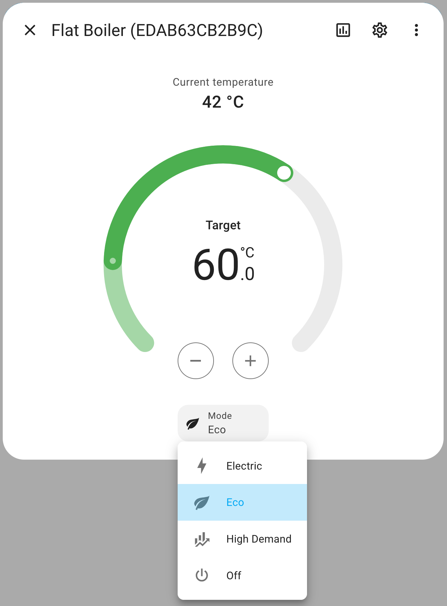
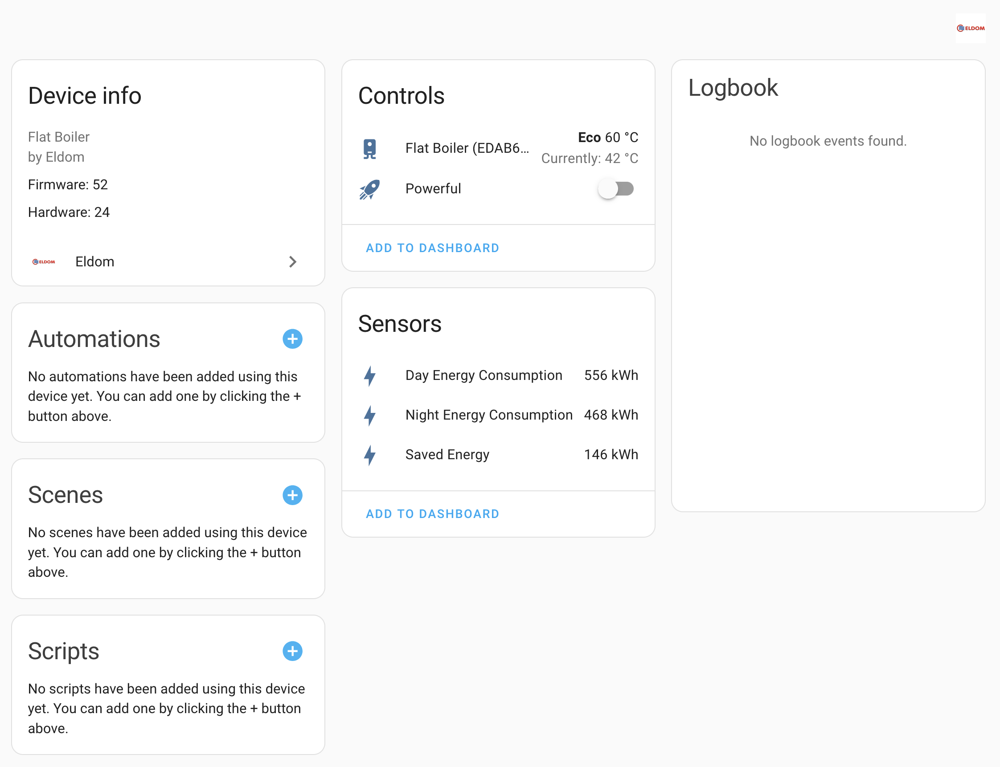

---

# Eldom Integration For Home Assistant

Connect your [Eldom](https://eldominvest.com/en/index.html) devices to Home Assistant and operate them via Eldom's Cloud APIs with [pyeldom](https://github.com/qbaware/pyeldom).

, or you can just ⭐️ the repository. I'd love that too. :smile:

---

## Features

This integration allows you to control Eldom devices via Home Assistant.

Note that there's only one way to control your Eldom devices - via their Cloud APIs. There's no support for local network control.

### Supported devices

#### 1. Flat boilers

- Operational mode selection
  - `Electric` (corresponds to "Heating")
  - `Eco` (corresponds to "Smart")
  - `High Demand` (corresponds to "Study")
  - `Off`
- Set target temperature
- Display current temperature
- Enable `Powerful mode` switch (only works while `Eco` mode is enabled)
- Display sensors
  - Heater is currently on/off
  - Day energy consumption
  - Night energy consumption
  - Saved energy

#### 2. Smart boilers

- Operational mode selection
  - `Electric` (corresponds to "Heating")
  - `Eco` (corresponds to "Smart")
  - `High Demand` (corresponds to "Study")
  - `Off`
- Set target temperature
- Display current temperature
- Enable `Powerful mode` switch (only works while `Eco` mode is enabled)
- Display sensors
  - Heater is currently on/off
  - Day energy consumption
  - Night energy consumption
  - Saved energy

#### 3. Convector heaters

- Operational mode selection
  - `Heat`
  - `Off`
- Set target temperature
- Display current temperature

### Showcase

## Installation

### HACS Installation

1. Open HACS.
2. Select `Integrations`, then select the 3-dots in the upper-right corner, then select `Custom Repositories`.
3. Put the reposity URL in the `Repository` field, then select `Integration` in the `Category` dropdown list and click `Add`.
4. Now, you can search for `Eldom` in HACS and install the integration.
5. After the installation, you need to restart Home Assistant.
6. Now, you can proceed with [Usage](#usage).

### Custom components

1. Download or clone the integration to your local machine.
2. Navigate to the `custom_components` directory in your Home Assistant installation directory.
3. Copy the folder `custom_components/eldom` from the downloaded integration to the Home Assistant `custom_components` directory.
4. Restart Home Assistant.

## Usage

- After installation, go to `Settings > Devices & services > Add integration` and search for `Eldom`.
- Provide an Eldom account `email` and `password` and click `Submit`.

## Community

For additional questions, you can head over to our [Discord channel](https://discord.gg/4sRmgb9Vph).
